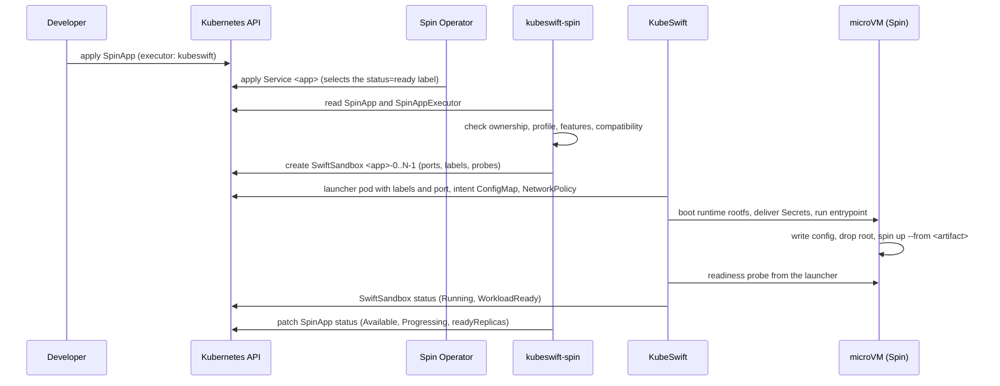
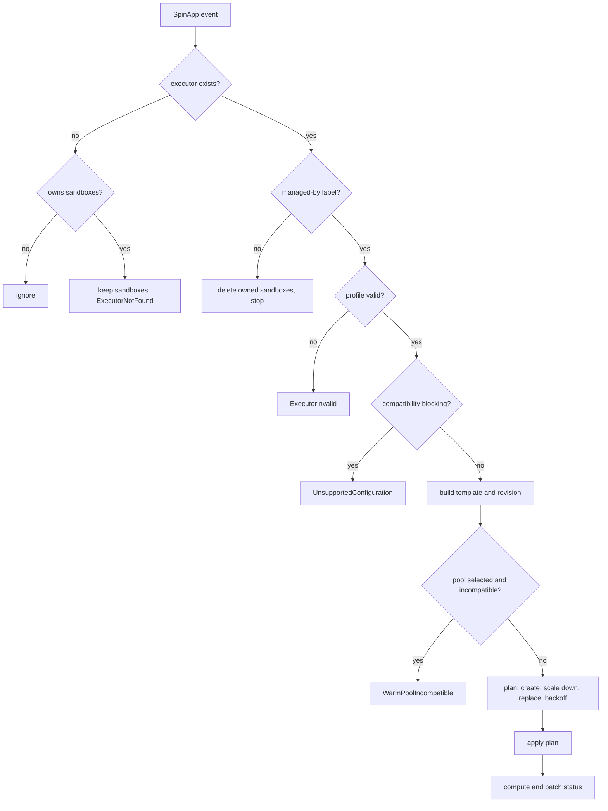
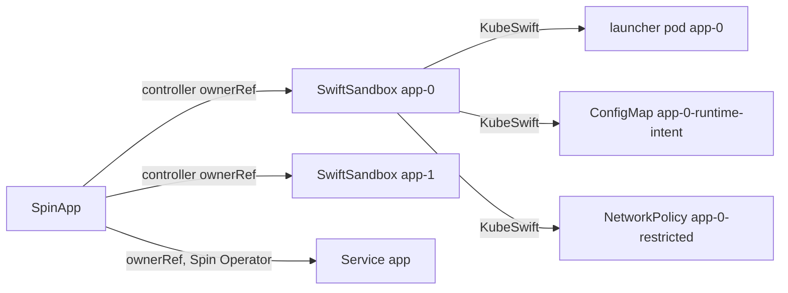
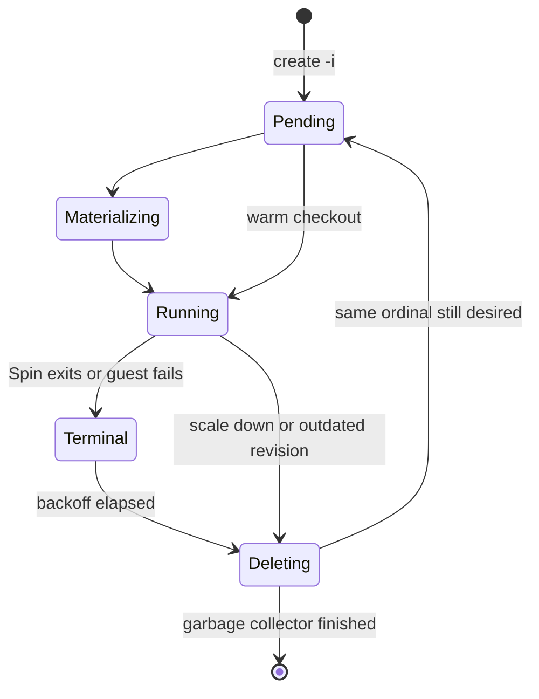
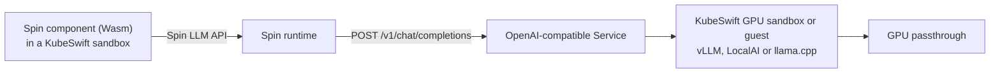
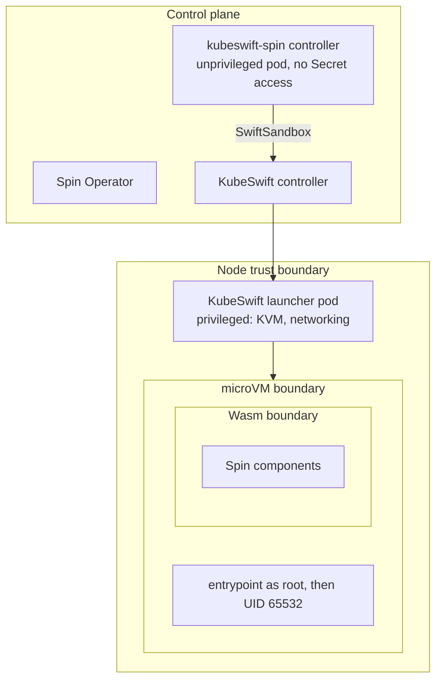

# Architecture

kubeswift-spin is a SpinKube executor implemented outside both SpinKube and
KubeSwift. Developers keep using the standard `SpinApp` API; an operator
selects a KubeSwift-backed `SpinAppExecutor`; kubeswift-spin turns each
replica into a KubeSwift `SwiftSandbox`, a Cloud Hypervisor microVM that runs
the Spin runtime.

```
Spin application developer
        |  SpinApp (core.spinkube.dev/v1alpha1)
        v
Spin Operator  ----  SpinAppExecutor with createDeployment: false
        |            (realized externally)
        v
kubeswift-spin  ---  this repository: the adapter
        |  SwiftSandbox (sandbox.kubeswift.io/v1alpha1)
        v
KubeSwift  --------  launcher pod, Cloud Hypervisor microVM
        |
        v
Spin runtime  -----  pulls the application OCI artifact, serves WebAssembly components
```

Responsibilities:

- **Spin** owns the application model: components, triggers, variables,
  runtime configuration, the Wasm sandbox.
- **SpinKube** owns the Kubernetes application API: `SpinApp`,
  `SpinAppExecutor`, and the SpinApp Service.
- **kubeswift-spin** owns the adapter: deciding which SpinApps it realizes,
  translating them, reconciling replicas, and reporting status.
- **KubeSwift** owns the isolated compute primitive: microVM lifecycle,
  rootfs delivery, networking posture, warm pools.

The dependency direction is SpinKube, then kubeswift-spin, then KubeSwift.
KubeSwift has no knowledge of Spin, and nothing in this repository changes
KubeSwift or reaches into its implementation. The rule used for every
design decision: a capability that is useful without Spin belongs in
KubeSwift; a capability that exists only because of Spin belongs here.
Generic gaps found while building this integration are written up as
proposals in [docs/upstream](upstream/).

## Verified upstream contracts

These facts were read from upstream source at the pinned versions; the
KubeSwift v0.16.0 facts were also exercised by the KVM e2e lab run (see
[compatibility.md](compatibility.md#kvm-e2e-lab-run-2026-10-05)). They
constrain the design.

**Spin Operator v0.6.1, `createDeployment: false`** (`internal/controller/spinapp_controller.go`):

- `updateStatus` returns before touching status, so the operator writes no
  SpinApp status for such executors.
- Any Deployment named after the SpinApp is deleted.
- The SpinApp Service is still server-side applied (port 80, target port
  `http-app`, selector `core.spinkube.dev/app.<name>.status=ready`).
- No runtime-config Secret, CA Secret, HPA or KEDA object is created.
- `SpinApp` has a status subresource but no scale subresource.
- The SpinApp webhook rejects `podAnnotations` and `deploymentAnnotations`
  for such executors and requires `replicas >= 1` unless autoscaling is
  enabled.

**KubeSwift v0.15.1 SwiftSandbox** (`api/sandbox/v1alpha1`, `internal/controller/swiftsandbox`).
These describe the degraded mode kubeswift-spin uses when the v0.16.0
features are not detected. KubeSwift v0.16.0 changes the items on `env`,
networking, launcher pod labels and warm-pool checkout (next list); the
others still hold.

- CPU (integer vCPUs), memory, command, args, environment, working
  directory, network mode (`restricted`, `open`, `none`), rootfs mode, kernel
  profile, node selector, warm-pool reference, private rootfs pull secret,
  cosign verification of the rootfs, scratch disk, model mount and GPU
  fields exist.
- The spec is immutable except `ttl`.
- `env` is merged as literal values into a runtime-intent ConfigMap;
  `valueFrom` is silently dropped. There is no secret or file projection.
- The launcher pod has `restartPolicy: Never`; a workload exit makes the
  sandbox terminal.
- The guest agent runs the workload as root and does not apply the OCI image
  user.
- Networked modes create a deny-ingress NetworkPolicy, and the guest sits
  behind the launcher pod's NAT. There is no port exposure, no Service
  integration and no readiness probe for sandboxes.
- Launcher pods carry only the `sandbox.kubeswift.io/sandbox` label.
- Warm-pool checkout compares image, network mode and verify key, and falls
  back to a cold boot on a mismatch or when no slot is free.
- The guest console is available through `swiftctl sandbox logs`.

**KubeSwift v0.16.0 SwiftSandbox** (closes kubeswift-io/kubeswift issues
#729 to #733):

- `spec.network.ports` exposes named guest ports on the launcher pod, and
  the sandbox NetworkPolicy admits ingress to those ports only, from any
  source unless `spec.network.ingress.from` lists NetworkPolicy peers.
- `spec.readinessProbe` and `spec.livenessProbe` are run by the launcher
  against the guest; readiness is reported as the `WorkloadReady` condition.
- `spec.podMetadata` puts labels and annotations on the launcher pod; keys
  under `kubeswift.io` domains are refused.
- `env[].valueFrom.secretKeyRef` is honored: the launcher reads the Secret
  with its own per-sandbox ServiceAccount and hands the value to the guest
  without writing it to any object, log or node disk. Other `valueFrom`
  sources are refused.
- `spec.secretFiles` writes Secret keys as files in the guest; it needs the
  sandbox kernel 6.6.14 or later.
- `spec.network.egress.allow` (restricted mode only) admits a Service
  ClusterIP or an IPv4 CIDR, optionally narrowed to ports;
  `169.254.0.0/16` stays blocked.
- `spec.artifacts` mounts OCI artifacts read-only. kubeswift-spin does not
  use it: Spin 4.2.1 cannot run an application from a local OCI layout.
- Warm-pool checkout compares the full slot shape (image, network mode,
  egress, ports, verify key, rootfs mode, kernel, CPU, memory, node
  selector) and boots cold on a mismatch; sandboxes with artifacts always
  boot cold.

**Spin v4.2.1**:

- `spin up --from <oci-ref>` pulls and runs a registry application;
  `--listen` (or `SPIN_HTTP_LISTEN_ADDR`) sets the HTTP address;
  `--component-id` (experimental) selects components; `--runtime-config-file`
  loads runtime configuration.
- Application variables are read from `SPIN_VARIABLE_<NAME>`; the
  environment provider is always active.
- Registry credentials come from `$XDG_CONFIG_HOME/fermyon/registry-auth.json`
  or Docker credential configuration inside the process environment.
- Runtime configuration supports `key_value_store`, `sqlite_database`,
  `llm_compute` (`spin` or `remote_http`, the latter with
  `api_type = "open_ai"` for OpenAI-compatible servers), variables providers
  and outbound networking settings.
- `spin up` handles SIGINT, SIGTERM and SIGHUP by terminating its trigger
  processes.
- OpenTelemetry export is configured with the standard `OTEL_EXPORTER_OTLP_*`
  variables. An experimental WASI OTel interface is behind
  `--experimental-wasi-otel` and is not used.
- WASIp3 HTTP components are supported; the default Rust template uses
  spin-sdk 7 with async `#[http_service]` handlers. Local service chaining
  uses `*.spin.internal` hosts within one application.
- There is no Spin-maintained MCP SDK; the third-party wasmcp project builds
  MCP servers from components.

The consequences: with KubeSwift v0.16.0, the controller runs Spin in
sandboxes, exposes them through Spin Operator's unchanged Service, verifies
readiness with KubeSwift probes and delivers Secrets by reference, using
only public SwiftSandbox fields. With v0.15.1 it can run and manage replicas
but not expose them, verify their readiness or give them secrets.

## Control flow



## Reconciliation

One controller reconciles SpinApps. It watches SpinApps (spec changes),
SwiftSandboxes it owns (status changes), SpinAppExecutors (mapped to the
SpinApps that use them through a field index) and, when installed,
SwiftSandboxPools (mapped through the executors that reference them). The
informer cache holds only SwiftSandboxes labelled
`app.kubernetes.io/managed-by=kubeswift-spin`.



Translation (`internal/translate`), compatibility analysis
(`internal/compatibility`), rollout planning (`internal/rollout`) and
status computation (`internal/status`) are pure functions. The reconciler
(`internal/controller`) only reads, decides with those functions, and
writes. See [executor-contract.md](executor-contract.md) for the exact
rules.

## Resource ownership



kubeswift-spin creates only SwiftSandboxes. Everything below a SwiftSandbox
belongs to KubeSwift; the Service belongs to Spin Operator. There is no
kubeswift-spin CRD and no finalizer.

## Two OCI artifacts

```mermaid
flowchart LR
    RI["runtime rootfs image\nghcr.io/kubeswift-io/kubeswift-spin-runtime\n(Spin binary, entrypoint, CA bundle)"] -- SwiftSandbox.spec.image --> KS[KubeSwift materializes rootfs on the node]
    APP["Spin application artifact\nSpinApp.spec.image\n(manifest + Wasm layers)"] -- spin up --from --> SP[Spin pulls inside the guest]
```

- The **runtime rootfs image** is a normal container image that KubeSwift
  pulls (optionally with a pull secret and cosign verification) and turns
  into the guest root filesystem. It is the same for every SpinApp, so a
  node materializes it once and warm pools can hold it booted.
- The **Spin application artifact** is a Spin OCI artifact produced by
  `spin registry push`. Spin pulls it from inside the guest when it starts.
  It is not converted into a container image.

Consequences: the guest needs network egress to the application registry,
which rules out network mode `none`, and registry credentials for a private
registry must be inside the guest. kubeswift-spin delivers them from
`imagePullSecrets` as KubeSwift secret files (KubeSwift v0.16.0; see
[executor-contract.md](executor-contract.md#registry-credentials)).
KubeSwift v0.16.0 can also mount OCI artifacts read-only, which would keep
credentials on the host, but Spin 4.2.1 cannot run an application from a
local OCI layout, so kubeswift-spin does not use it
([kubeswift-sandbox-artifact-projection.md](upstream/kubeswift-sandbox-artifact-projection.md)).

## Runtime image

The runtime image contains the static Spin v4.2.1 binary (checksum-pinned),
the kubeswift-spin entrypoint and the distroless `static` base (CA bundle,
passwd entries, no shell, no package manager). The entrypoint prepares
writable directories on the guest's memory-backed overlay, writes the
runtime-config file (substituting Secret values) and the registry
credentials, switches from root to UID 65532, sets `no_new_privs` and execs
Spin. See [runtime-image.md](runtime-image.md).

## Replica lifecycle



Replicas follow a StatefulSet-like model: ordinal `i` is always the sandbox
named `<app>-i`. Immutable sandbox specs mean replacement is delete then
recreate, gated so at most one available replica (ready on KubeSwift
v0.16.0) is replaced at a time.

## Networking

On KubeSwift v0.16.0, kubeswift-spin sets `spec.network.ports` (`http-app`,
guest port 3000), `spec.podMetadata` with the label
`core.spinkube.dev/app.<name>.status=ready`, and readiness and liveness
probes on every SwiftSandbox. KubeSwift exposes the port on the launcher
pod and admits ingress to it; Spin Operator's unchanged SpinApp Service
selects the launcher pods, and its endpoints follow readiness. Egress stays
under KubeSwift's network mode, optionally widened by an allowlist of
Services or CIDRs.

kubeswift-spin still creates no NetworkPolicy, Service or EndpointSlice,
and never modifies launcher pods, adds sidecars or programs iptables
([ADR 0005](adr/0005-sandbox-networking-boundary.md)). It uses each
KubeSwift feature only when the published OpenAPI schema shows it
([ADR 0012](adr/0012-feature-detection.md)). On KubeSwift v0.15.1 HTTP
SpinApps run but are not reachable, and their status says so
(`Available=False`, `NetworkUnavailable`). Details:
[networking.md](networking.md).

## Status

SpinApp status is computed from the observed sandboxes, the compatibility
findings and the detected features, and written onto the standard SpinKube
fields. `Running` is never treated as ready: a replica is ready only when its
sandbox has a readiness probe and KubeSwift reports `WorkloadReady=True`.
Running replicas that do not pass the probe yet give `Available=False` with
reason `ApplicationNotReady`. See
[executor-contract.md](executor-contract.md#status).

## Warm pools

A profile can name a SwiftSandboxPool. Pools hold pre-booted runtime rootfs
microVMs; a SwiftSandbox with `poolRef` claims one and receives its
command and environment over vsock, skipping the cold boot. The pool is
capacity, not the replica set: kubeswift-spin still creates one SwiftSandbox
per replica. kubeswift-spin verifies the full slot shape, including exposed
ports and the egress allowlist, before it sets `poolRef`, and refuses an
incompatible pool with `WarmPoolIncompatible`. KubeSwift v0.16.0 also
compares the full shape at checkout; v0.15.1 did not (see
[kubeswift-sandbox-pool-shape-enforcement.md](upstream/kubeswift-sandbox-pool-shape-enforcement.md)).

## AI inference path



The application plane (Spin, small artifacts, fast lifecycle) and the
inference plane (KubeSwift GPU lifecycle, model preload, warm GPU pools)
stay separate; no Spin sandbox needs a GPU. A restricted Spin sandbox
reaches the inference Service through an egress allowlist entry, with its
token delivered from a Secret; that path was validated on the lab cluster
against a mock server, not against a GPU. See
[serverless-ai.md](serverless-ai.md).

## MCP tool servers

```
AI agent --> MCP server (Spin component) --> Spin runtime --> KubeSwift microVM
```

Third-party or dynamically deployed MCP tools get two independent
boundaries: WebAssembly capability isolation enforced by Spin (only the
hosts, variables and stores the manifest allows) and a hardware-virtualized
microVM. This narrows what a malicious tool can reach; it does not remove
trust in the hypervisor, the guest kernel, the KubeSwift launcher or the
host. On KubeSwift v0.16.0 an agent reaches an MCP server in a sandbox
through the SpinApp Service, like any HTTP SpinApp. The example in
[examples/experimental/mcp](../examples/experimental/mcp/) is experimental
and has not been run in a sandbox.

## Trust boundaries



See [security-model.md](security-model.md) for assets, threats and known
limitations.
